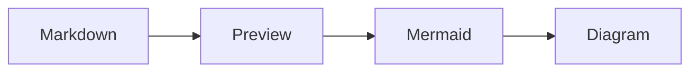

# MD_RENDER

A native markdown renderer for macOS and Linux, built with Tauri, React, and
TypeScript. It pairs a split-pane editor/preview with a documentation-site
reading layout — collapsible index, reading progress, and a set of six
typographic themes.

## Features

- Native macOS and Linux app built with Tauri 2.x
- Six typographic themes — three light (Warm Paper, Newsprint, Forest) and three
  dark (Midnight Ink, Nocturne, Evergreen), each with its own fonts, colors, and
  code-syntax palette — chosen from a swatch popover
- Collapsible split-pane editor and preview with a draggable divider
- Manual Save control plus 30-second autosave/refresh for opened markdown files
- Collapsible document index, auto-built from headings, with scroll-spy
  highlighting and foldable sections
- Reading-progress bar and hover anchor links on headings
- Syntax highlighting for code blocks (highlight.js)
- Mermaid diagrams from fenced `mermaid` or `language-mermaid` code blocks
- Math with KaTeX — inline `$…$`, `$$…$$`, and ` ```math ` blocks
- GitHub Flavored Markdown: tables, task lists, strikethrough
- Local images resolved relative to the open file, plus inline SVG and raw HTML
- System color-scheme detection picks a light or dark theme on first run
- 70% text width for comfortable reading
- File associations for `.md` and `.markdown` files
- Several files open as tabs, in the window or in the browser
- Server mode (`mdrender --port a.md ./docs`) serving the same app on port
  10000, with the same editing and saving, usable over SSH from a headless
  machine

## Themes

Pick a theme from the palette button in the top-right controls; the choice is
remembered between sessions.

| Light | Dark |
|-------|------|
| Warm Paper — book typography on aged cream | Midnight Ink — warm ink on blue-black |
| Newsprint — high-contrast editorial broadsheet | Nocturne — muted iris & foam on plum |
| Forest — moss and bark on a sage page | Evergreen — moss and amber on pine-black |

## Installation

`make install` detects the platform and runs the right target, so the same
command works on both systems:

```bash
make build          # build the app for the current platform
make install        # build and install for the current platform
make install-macos  # install MD_RENDER.app plus ~/bin/mdrender
make install-linux  # install into $PREFIX (default ~/.local), no root needed
make install-clean  # install, then remove dist/ and src-tauri/target/
make test           # run the test suite
make clean          # remove local build artifacts
```

### macOS

#### From Release

1. Download `MD_RENDER.app` from releases
2. Move to `/Applications/`
3. Install the wrapper script (see below)

#### Building from Source

```bash
git clone <repo-url>
cd md_render
npm install
npm run tauri:build

# Install (replace any existing copy)
rm -rf /Applications/MD_RENDER.app
cp -R src-tauri/target/release/bundle/macos/MD_RENDER.app /Applications/
```

### Linux

Build prerequisites (Debian/Ubuntu — package names differ on other distros):

```bash
sudo apt install build-essential curl wget file pkg-config \
  libwebkit2gtk-4.1-dev libxdo-dev libssl-dev \
  libayatana-appindicator3-dev librsvg2-dev libgtk-3-dev
```

Rust and Node are also required; install Rust with
[rustup](https://rustup.rs) as your normal user.

```bash
git clone <repo-url>
cd md_render
npm install
make install-linux
```

`make install-linux` installs entirely under your home directory — no root
required:

| Path | Contents |
|------|----------|
| `~/.local/bin/md-render` | the application binary |
| `~/bin/mdrender` | command-line wrapper |
| `~/.local/share/applications/md-render.desktop` | desktop entry and `.md` association |
| `~/.local/share/icons/hicolor/*/apps/md-render.png` | icons |

Set `PREFIX` to install elsewhere, e.g. `make install-linux PREFIX=/usr/local`
(that location needs write access). Make sure `~/.local/bin` and `~/bin` are on
your `PATH`.

`npm run tauri:build` also produces distributable bundles under
`src-tauri/target/release/bundle/` — `.deb`, `.rpm`, and `.AppImage`. Install
the `.deb` with `sudo apt install ./MD_RENDER_0.1.0_amd64.deb`, or run the
AppImage directly with no installation at all.

## Server Mode

Render markdown in a browser instead of the desktop window:

```bash
mdrender --port notes.md ./docs
```

```
serving 4 files on http://127.0.0.1:10000
  [1] notes.md
  [2] api.md
  [3] guide/setup.md
  [4] guide/usage.md
(ctrl-c to stop)
```

The port defaults to **10000**; pass a number to override it:

```bash
mdrender --port 8080 notes.md
```

Each file becomes a tab; directory arguments contribute every `.md` and
`.markdown` file found beneath them. Open the URL in a browser and everything
works as it does in the desktop app — tabs, the document index, themes, math,
Mermaid diagrams, images, and editing and saving back to disk.

The desktop window takes the same arguments and opens the same tabs:

```bash
mdrender notes.md ./docs
```

Running the same command again while a server is already on that port **adds
the file as another tab** rather than failing:

```bash
mdrender --port extra.md
# added to http://127.0.0.1:10000
#   extra.md
```

An open browser picks the new tab up within a few seconds without a reload.

### Reading a document on a remote machine

This is the main reason the mode exists — the machine rendering the markdown
needs no display:

```bash
ssh -L 10000:127.0.0.1:10000 my-server
mdrender --port ~/notes.md           # on the server
```

Then open `http://127.0.0.1:10000` in your local browser.

### What server mode can do

Server mode has the same capabilities as the desktop window: editing, saving,
autosave, review comments and exporting the clean copy all work in the browser
and write to the same files on disk.

What it will not do:

- It binds `127.0.0.1` by default. `--host` overrides this and prints a warning,
  since any other address exposes your file contents — and the ability to edit
  them — to the network.
- Reads and writes are limited to the documents the server was told to open.
  Sitting inside a served directory is not enough, so a stray file next to your
  markdown cannot be read or overwritten.
- Images are only served from the directories of the documents being served,
  and only if they carry an image extension. Requests are resolved and checked
  against that allowlist, so `..` and symlinks cannot escape it.
- Every write carries a token that the server injects into the page it serves.
  Handing the token to the page grants exactly the trust already implied by
  being able to reach the port, while stopping a page on another origin from
  forging a write, since it cannot read the token.
- Adding tabs to a running server requires the token from
  `$XDG_STATE_HOME/md-render/servers/<port>.json`, written with mode `0600`, so
  only processes running as the same user can widen what the server touches.

Note that ports run from 1 to 65535; anything outside that range is rejected
with an error rather than being silently clamped.

## Wrapper Script

The wrapper script allows opening files with the app from the command line. Save this as `~/bin/mdrender`:

```bash
#!/bin/bash
if [ -z "$1" ]; then
  open -a MD_RENDER
else
  # Use realpath if available, otherwise use the file as-is
  if command -v realpath &> /dev/null; then
    FILE="$(realpath "$1")"
  else
    FILE="$1"
  fi
  TAURI_LAUNCH_FILE="$FILE" open -a MD_RENDER
fi
```

Make it executable:

```bash
chmod +x ~/bin/mdrender
```

Add `~/bin` to your PATH if not already:

```bash
echo 'export PATH="$HOME/bin:$PATH"' >> ~/.zshrc
source ~/.zshrc
```

Usage:

```bash
mdrender README.md
mdrender ~/.claude/plans/my-plan.md
```

When MD_RENDER opens a local `.md` or `.markdown` file, edits made in the
editor pane can be saved immediately with the Save button. Unsaved local edits
also autosave back to that file every 30 seconds and before the window closes.
If there are no local edits waiting to save, the same 30-second sync refreshes
the rendered text from disk. If the app is opened without a file, draft content
is kept in browser storage for the next session and can also be saved with the
Save button.

## Mermaid Diagrams

MD_RENDER renders Mermaid fences as diagrams instead of highlighted source. Use
either `mermaid` or `language-mermaid` as the fence language:



If Mermaid cannot parse a diagram, MD_RENDER shows a readable render error and
keeps the original source visible as a fallback code block.

## Claude Code Hooks Integration

MD_RENDER can automatically open plan files when Claude Code writes them. This is useful for reviewing plans in a readable format.

### Hook Script

Save this as `~/.claude/hooks/open-plan-in-md-render.sh`:

```bash
#!/bin/bash
# Hook to open plan files in MD_RENDER after Write tool executes

# Read JSON input from stdin
INPUT=$(cat)

# Extract file_path from tool_input using jq
FILE_PATH=$(echo "$INPUT" | jq -r '.tool_input.file_path // empty')

# Check if file is in the plans directory
if [[ "$FILE_PATH" == ~/.claude/plans/* ]]; then
    ~/bin/mdrender "$FILE_PATH" 2>/dev/null &
fi

# Always exit 0 to not block Claude
exit 0
```

Make it executable:

```bash
chmod +x ~/.claude/hooks/open-plan-in-md-render.sh
```

### Claude Settings Configuration

Add this to your `~/.claude/settings.json`:

```json
{
  "hooks": {
    "PostToolUse": [
      {
        "matcher": "Write",
        "hooks": [
          {
            "type": "command",
            "command": "/Users/YOUR_USERNAME/.claude/hooks/open-plan-in-md-render.sh"
          }
        ]
      }
    ]
  }
}
```

Replace `YOUR_USERNAME` with your actual username.

Now whenever Claude Code writes a file to `~/.claude/plans/`, it will automatically open in MD_RENDER.

## Setting as Default App

To set MD_RENDER as the default app for markdown files:

```bash
# Install duti
brew install duti

# Set as default for .md and .markdown files
duti -s com.mdrender.app .md all
duti -s com.mdrender.app .markdown all
```

Or manually: Right-click any .md file > Get Info > Open with > MD_RENDER > Change All...

## Tech Stack

- **Frontend**: React 18, TypeScript, Vite, Framer Motion
- **Backend**: Tauri 2.x (Rust), with the asset protocol enabled for local images
- **Styling**: Tailwind CSS; theme tokens are CSS custom properties defined in `src/lib/themes.ts`
- **Markdown**: react-markdown with remark-gfm, remark-math, rehype-raw, rehype-slug, rehype-highlight, rehype-katex
- **Diagrams**: Mermaid for fenced flowcharts, sequence diagrams, and other Mermaid-supported diagram types
- **Math**: KaTeX
- **Fonts**: Playfair Display, Source Serif 4, Spectral, Fraunces, EB Garamond (prose); IBM Plex Mono, JetBrains Mono (code) — each theme picks its own pairing

## Development

```bash
# Start development (Tauri window + Vite)
npm run tauri:dev

# Build for production
npm run tauri:build

# Run the frontend only, in a browser
npm run dev

# Run the test suite (Vitest)
npm test

# Lint
npm run lint
```

## Project Structure

```
md_render/
├── src/                    # React frontend
│   ├── components/         # Editor, Preview, ThemePicker, TableOfContents, ReadingProgress
│   ├── hooks/              # useTheme — applies the active theme's CSS variables
│   ├── lib/                # themes registry, image-path resolution, sample content
│   ├── test/               # Vitest suites
│   ├── App.tsx             # Layout, panes, file loading, floating controls
│   └── index.css           # Base styles and per-theme flourishes
├── src-tauri/              # Tauri backend (Rust)
│   ├── src/lib.rs          # read_file / get_launch_file commands
│   ├── tauri.conf.json     # Tauri configuration (asset protocol enabled)
│   ├── Info.plist          # macOS file associations
│   └── Cargo.toml          # Rust dependencies
├── bin/
│   └── mdrender            # Wrapper script
└── package.json
```

## License

MIT
