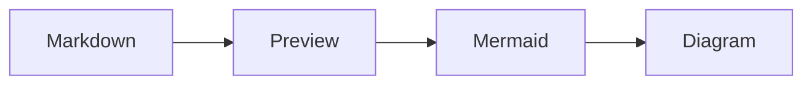

# MD_RENDER

A native macOS markdown renderer built with Tauri, React, and TypeScript. It
pairs a split-pane editor/preview with a documentation-site reading layout —
collapsible index, reading progress, and a set of six typographic themes.

## Features

- Native macOS app built with Tauri 2.x
- Six typographic themes — three light (Warm Paper, Newsprint, Forest) and three
  dark (Midnight Ink, Nocturne, Evergreen), each with its own fonts, colors, and
  code-syntax palette — chosen from a swatch popover
- Collapsible split-pane editor and preview with a draggable divider
- Manual Save control plus 30-second autosave/refresh for opened markdown files
- Collapsible document index, auto-built from headings, with scroll-spy
  highlighting and foldable sections
- Reading-progress bar and hover anchor links on headings
- Syntax highlighting for code blocks (highlight.js)
- Mermaid diagrams from fenced `mermaid` or `language-mermaid` code blocks
- Math with KaTeX — inline `$…$`, `$$…$$`, and ` ```math ` blocks
- GitHub Flavored Markdown: tables, task lists, strikethrough
- Local images resolved relative to the open file, plus inline SVG and raw HTML
- System color-scheme detection picks a light or dark theme on first run
- 70% text width for comfortable reading
- File associations for `.md` and `.markdown` files

## Themes

Pick a theme from the palette button in the top-right controls; the choice is
remembered between sessions.

| Light | Dark |
|-------|------|
| Warm Paper — book typography on aged cream | Midnight Ink — warm ink on blue-black |
| Newsprint — high-contrast editorial broadsheet | Nocturne — muted iris & foam on plum |
| Forest — moss and bark on a sage page | Evergreen — moss and amber on pine-black |

## Installation

### From Release

1. Download `MD_RENDER.app` from releases
2. Move to `/Applications/`
3. Install the wrapper script (see below)

### Building from Source

```bash
# Clone and install dependencies
git clone <repo-url>
cd md_render
npm install

# Build
npm run tauri:build

# Install (replace any existing copy)
rm -rf /Applications/MD_RENDER.app
cp -R src-tauri/target/release/bundle/macos/MD_RENDER.app /Applications/
```

Or use the Makefile:

```bash
make build          # build the macOS app bundle
make install        # build and install to /Applications plus ~/bin/mdrender
make install-clean  # install, then remove dist/ and src-tauri/target/
make clean          # remove local build artifacts
```

## Wrapper Script

The wrapper script allows opening files with the app from the command line. Save this as `~/bin/mdrender`:

```bash
#!/bin/bash
if [ -z "$1" ]; then
  open -a MD_RENDER
else
  # Use realpath if available, otherwise use the file as-is
  if command -v realpath &> /dev/null; then
    FILE="$(realpath "$1")"
  else
    FILE="$1"
  fi
  TAURI_LAUNCH_FILE="$FILE" open -a MD_RENDER
fi
```

Make it executable:

```bash
chmod +x ~/bin/mdrender
```

Add `~/bin` to your PATH if not already:

```bash
echo 'export PATH="$HOME/bin:$PATH"' >> ~/.zshrc
source ~/.zshrc
```

Usage:

```bash
mdrender README.md
mdrender ~/.claude/plans/my-plan.md
```

When MD_RENDER opens a local `.md` or `.markdown` file, edits made in the
editor pane can be saved immediately with the Save button. Unsaved local edits
also autosave back to that file every 30 seconds and before the window closes.
If there are no local edits waiting to save, the same 30-second sync refreshes
the rendered text from disk. If the app is opened without a file, draft content
is kept in browser storage for the next session and can also be saved with the
Save button.

## Mermaid Diagrams

MD_RENDER renders Mermaid fences as diagrams instead of highlighted source. Use
either `mermaid` or `language-mermaid` as the fence language:



If Mermaid cannot parse a diagram, MD_RENDER shows a readable render error and
keeps the original source visible as a fallback code block.

## Claude Code Hooks Integration

MD_RENDER can automatically open plan files when Claude Code writes them. This is useful for reviewing plans in a readable format.

### Hook Script

Save this as `~/.claude/hooks/open-plan-in-md-render.sh`:

```bash
#!/bin/bash
# Hook to open plan files in MD_RENDER after Write tool executes

# Read JSON input from stdin
INPUT=$(cat)

# Extract file_path from tool_input using jq
FILE_PATH=$(echo "$INPUT" | jq -r '.tool_input.file_path // empty')

# Check if file is in the plans directory
if [[ "$FILE_PATH" == ~/.claude/plans/* ]]; then
    ~/bin/mdrender "$FILE_PATH" 2>/dev/null &
fi

# Always exit 0 to not block Claude
exit 0
```

Make it executable:

```bash
chmod +x ~/.claude/hooks/open-plan-in-md-render.sh
```

### Claude Settings Configuration

Add this to your `~/.claude/settings.json`:

```json
{
  "hooks": {
    "PostToolUse": [
      {
        "matcher": "Write",
        "hooks": [
          {
            "type": "command",
            "command": "/Users/YOUR_USERNAME/.claude/hooks/open-plan-in-md-render.sh"
          }
        ]
      }
    ]
  }
}
```

Replace `YOUR_USERNAME` with your actual username.

Now whenever Claude Code writes a file to `~/.claude/plans/`, it will automatically open in MD_RENDER.

## Setting as Default App

To set MD_RENDER as the default app for markdown files:

```bash
# Install duti
brew install duti

# Set as default for .md and .markdown files
duti -s com.mdrender.app .md all
duti -s com.mdrender.app .markdown all
```

Or manually: Right-click any .md file > Get Info > Open with > MD_RENDER > Change All...

## Tech Stack

- **Frontend**: React 18, TypeScript, Vite, Framer Motion
- **Backend**: Tauri 2.x (Rust), with the asset protocol enabled for local images
- **Styling**: Tailwind CSS; theme tokens are CSS custom properties defined in `src/lib/themes.ts`
- **Markdown**: react-markdown with remark-gfm, remark-math, rehype-raw, rehype-slug, rehype-highlight, rehype-katex
- **Diagrams**: Mermaid for fenced flowcharts, sequence diagrams, and other Mermaid-supported diagram types
- **Math**: KaTeX
- **Fonts**: Playfair Display, Source Serif 4, Spectral, Fraunces, EB Garamond (prose); IBM Plex Mono, JetBrains Mono (code) — each theme picks its own pairing

## Development

```bash
# Start development (Tauri window + Vite)
npm run tauri:dev

# Build for production
npm run tauri:build

# Run the frontend only, in a browser
npm run dev

# Run the test suite (Vitest)
npm test

# Lint
npm run lint
```

## Project Structure

```
md_render/
├── src/                    # React frontend
│   ├── components/         # Editor, Preview, ThemePicker, TableOfContents, ReadingProgress
│   ├── hooks/              # useTheme — applies the active theme's CSS variables
│   ├── lib/                # themes registry, image-path resolution, sample content
│   ├── test/               # Vitest suites
│   ├── App.tsx             # Layout, panes, file loading, floating controls
│   └── index.css           # Base styles and per-theme flourishes
├── src-tauri/              # Tauri backend (Rust)
│   ├── src/lib.rs          # read_file / get_launch_file commands
│   ├── tauri.conf.json     # Tauri configuration (asset protocol enabled)
│   ├── Info.plist          # macOS file associations
│   └── Cargo.toml          # Rust dependencies
├── bin/
│   └── mdrender            # Wrapper script
└── package.json
```

## License

MIT
