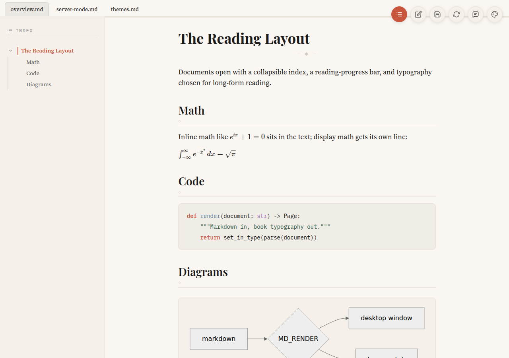

# MD_RENDER

[](https://github.com/AadityaSalgarkar/md_render/actions/workflows/ci.yml)
[](https://github.com/AadityaSalgarkar/md_render/releases/latest)

Markdown, set like a book. A renderer for macOS and Linux built on Tauri 2 —
six typographic themes, a document index, math, Mermaid, review comments, and
a server mode that puts the same app in your browser over SSH.

```bash
curl -fsSL https://aadityasalgarkar.github.io/md_render/install.sh | sh
```

**[Documentation](https://aadityasalgarkar.github.io/md_render/)** ·
[llms.txt](https://aadityasalgarkar.github.io/md_render/llms.txt) ·
[skills.md](https://aadityasalgarkar.github.io/md_render/skills.md)



## Features

- Six typographic themes — three light (Warm Paper, Newsprint, Forest), three
  dark (Midnight Ink, Nocturne, Evergreen) — each with its own faces, colors,
  and code palette
- Collapsible document index built from headings, with scroll-spy and a
  reading-progress bar
- Several files open as tabs, in the window or in the browser; a refresh
  control picks up markdown added to a directory after launch
- GitHub-flavored markdown, KaTeX math, Mermaid diagrams, highlighted code,
  local images resolved relative to the file
- Split-pane editor with save, 30-second autosave, and save-on-close
- Review comments attached to selected passages, stored in the markdown
  itself, with clean export (`notes.md` → `notes.clean.md`)
- Quiz blocks: `<quiz>question <enumerate><option>…</option></enumerate></quiz>`
  renders a card whose options stay hidden until the eye button reveals them;
  an `<answer>…</answer>` inside (or anywhere) stays hidden until clicked
- Server mode with full parity: editing and saving work in the browser too

## Install

One line — detects the platform, checks prerequisites, clones and runs
`make install` (no sudo; it stops with instructions if build tools are
missing):

```bash
curl -fsSL https://aadityasalgarkar.github.io/md_render/install.sh | sh
```

Or grab a build from
[Releases](https://github.com/AadityaSalgarkar/md_render/releases/latest) —
dmg for macOS; deb, rpm or AppImage for Linux. The macOS builds are unsigned:
right-click → Open the first time (or
`xattr -d com.apple.quarantine /Applications/MD_RENDER.app`).

Or by hand:

```bash
git clone https://github.com/AadityaSalgarkar/md_render
cd md_render
npm install
make install
```

`make install` detects the platform. On macOS it installs `MD_RENDER.app` and
the `~/bin/mdrender` wrapper; on Linux everything lands under `~/.local` and
`~/bin` — no root. Linux needs the webkit2gtk build deps, and both need Rust
and Node; see the
[install docs](https://aadityasalgarkar.github.io/md_render/#install) for the
package list, `PREFIX=`, and the deb/rpm/AppImage bundles.

To make it the macOS default for markdown:
`brew install duti && duti -s com.mdrender.app .md all`

## Use

```bash
mdrender                    # open the app
mdrender notes.md           # open one file
mdrender a.md b.md ./docs   # several files and a directory — tabs
mdrender --port notes.md    # serve to a browser instead
```

Directory arguments contribute every markdown file beneath them. The window
and the server take the same arguments and open the same tabs.

## Server mode

```
$ mdrender --port notes.md ./docs
serving 4 files on http://127.0.0.1:10000
  [1] notes.md
  [2] api.md
  [3] guide/setup.md
  [4] guide/usage.md
(ctrl-c to stop)
```

The port defaults to 10000 (`--port 8080` overrides). Everything works as in
the window, including editing and saving back to disk. Running the command
again while a server holds the port adds the file as another tab instead of
failing.

Reading a document on a headless machine — the reason the mode exists:

```bash
ssh -L 10000:127.0.0.1:10000 my-server
mdrender --port ~/notes.md           # on the server
```

The server binds loopback by default, reads and writes only the documents it
was told to open, serves images only from their directories, and gates every
write behind a token injected into the page it serves. Details in the
[security notes](https://aadityasalgarkar.github.io/md_render/#security).

## Claude Code integration

A PostToolUse hook can open plan files in MD_RENDER the moment Claude Code
writes them, and agents can drive the app through
[skills.md](https://aadityasalgarkar.github.io/md_render/skills.md). Hook
script and settings in the
[docs](https://aadityasalgarkar.github.io/md_render/#claude).

## Development

```bash
npm run tauri:dev    # Tauri window + Vite dev server
npm run tauri:build  # production build and bundles
npm run dev          # frontend only, in a browser
make test            # Rust + frontend test suites
npm run lint
```

React 18 + TypeScript + Vite; react-markdown with remark-gfm, remark-math,
rehype-katex, rehype-highlight, rehype-raw; Tauri 2 with an axum server for
`--port`. Tests drive the real binary over real HTTP.

Commits follow [Conventional Commits](CONTRIBUTING.md); releases are cut
automatically by release-please, which keeps the three version files and
[CHANGELOG.md](CHANGELOG.md) in sync.

```
src/                 # React frontend
  components/        # Preview, Editor, TabBar, TableOfContents, ThemePicker, CommentPane
  lib/               # backend abstraction, theme registry, comments, image paths
  test/              # Vitest suites, including end-to-end server tests
src-tauri/src/       # Rust: lib.rs (commands), cli.rs, server.rs, attach.rs, state.rs
bin/mdrender         # cross-platform wrapper
docs/                # documentation site (GitHub Pages), llms.txt, skills.md
```

Note: plain `cargo build --release` emits `target/release/app`, which expects
the dev server and shows a blank window. The usable binary is
`target/release/md-render`, from `npm run tauri:build`.

## License

MIT
